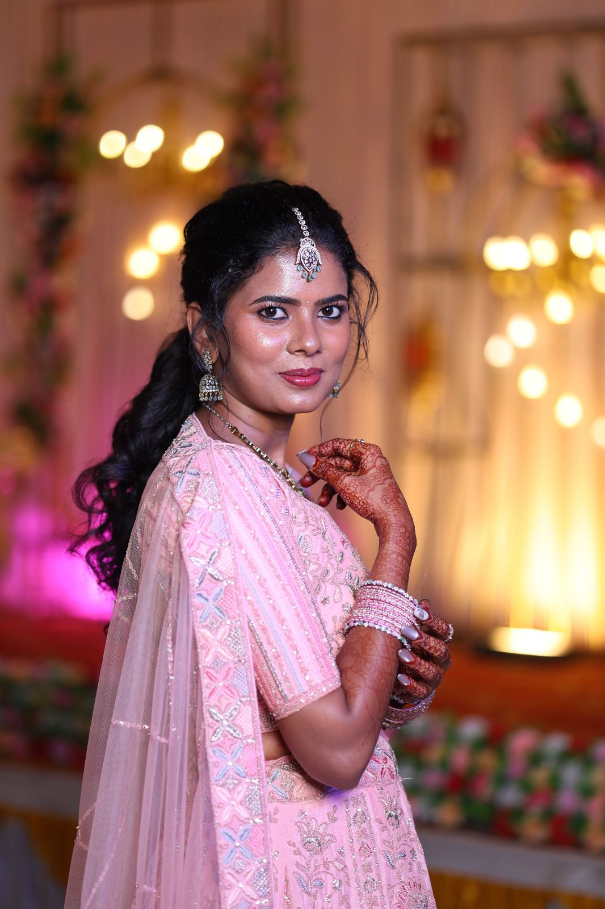

# ✦ Kalai Makeover – Landing Page ✦

A premium, responsive landing page for **Kalai Makeover**, a professional makeup artist and beauty parlour based in Kanchipuram, Tamil Nadu.



## ✨ Overview

This project is a high-end, single-page website designed to showcase bridal, engagement, and party makeup services. It features a modern, elegant design with smooth animations and a mobile-first approach.

## 🚀 Features

- **Responsive Design**: Fully optimized for mobile, tablet, and desktop views.
- **Service Showcases**: Detailed sections for Bridal, Engagement, Party, and Saree Draping services.
- **Interactive Portfolio**: A masonry-style gallery showing off professional work.
- **WhatsApp Integration**: Floating contact button and direct booking links for seamless client conversion.
- **Modern Aesthetics**: Built with a curated color palette (Blush, Gold, Cream) and premium typography (Cormorant Garamond & Jost).
- **Performance Optimized**: Lightweight static site with CDN-delivered assets.

## 🛠️ Tech Stack

- **HTML5**: Semantic structure.
- **Tailwind CSS**: Modern utility-first styling for rapid, responsive UI development.
- **JavaScript**: Custom scroll reveals, navbar transitions, and mobile menu logic.
- **Google Fonts**: Premium typography integration.

## 📁 Project Structure

```text
kalai-landing-page/
├── assets/             # Project images and icons
├── index.html          # Main landing page
└── README.md           # Documentation
```

## 📸 Portfolio Highlights

The landing page showcases a range of looks including:
- **Bridal**: HD & Airbrush finishes for the big day.
- **Engagement**: Glowing, camera-ready looks.
- **Party**: Vibrant styles for sangeet and receptions.
- **Saree Draping**: Expert pre-pleating and styling.

## 📞 Contact & Booking

For inquiries or bookings, you can reach Kalai Makeover at:
- **Phone/WhatsApp**: [+91 8870236006](https://wa.me/918870236006)
- **Instagram**: [@kalaimakeover](https://www.instagram.com/kalaimakeover)
- **Location**: Kanchipuram, Tamil Nadu (Available for travel across TN)

---

*Designed and Developed for Kalai Makeover.*
